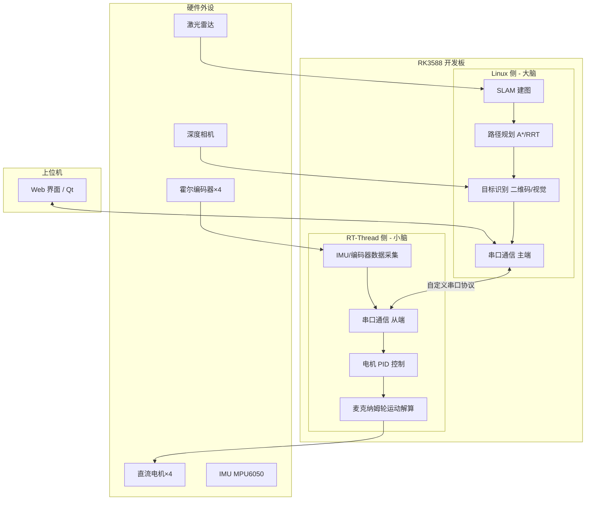

# 室内智能配送机器人 —— 基于 RT-Thread 虚拟化混合部署

> 全国大学生嵌入式芯片与系统设计竞赛'2026 · 睿赛德赛题 · 选题一应用2

## 项目简介

本项目实现了一台室内智能配送机器人，能够自主导航、动态避障、精准停靠，完成指定地点的物品配送任务。机器人基于 **瑞芯微 RK3588** 平台，运行 **RT-Thread 虚拟化混合部署** 方案：

- **Linux 侧**（大脑）：负责 SLAM 建图、路径规划、目标识别（二维码/房间标识）、动态障碍物检测
- **RT-Thread 侧**（小脑）：负责电机 PID 控制、麦克纳姆轮运动解算、多传感器融合定位、紧急停障

两部分通过串口通信协议协同工作，并配有可视化监控界面（Web/桌面端）。


## 系统架构



## 硬件清单

| 部件 | 型号/规格 | 数量 | 备注 |
|------|-----------|------|------|
| 主控平台 | 瑞芯微 RK3588 开发板（官方套件/Orange Pi 5） | 1 | 运行虚拟化混合部署 |
| 机器人底盘 | 四轮麦克纳姆轮底盘（含直流减速电机） | 1 | 全向移动 |
| 电机驱动板 | 支持 PWM / 编码器读取（如 TB6612 或 L298N） | 1 | 需 4 路 |
| 激光雷达 | RPLIDAR A1 / A2 | 1 | 用于 SLAM 建图 |
| 深度相机 | Intel RealSense D435 / Astra Pro | 1 | 可选，用于视觉感知 |
| IMU | MPU6050 / ICM20948 | 1 | 姿态估计 |
| 编码器 | 霍尔编码器（集成在电机上） | 4 | 轮速反馈 |
| 电源 | 12V 锂电池组 | 1 | 为底盘和开发板供电 |

> 详细引脚连接请参见 [`docs/hardware_connection.md`](docs/hardware_connection.md)

## 软件依赖

### 通用
- Git
- Markdown 编辑器

### Linux 侧（运行在 RK3588 Ubuntu 上）
- Ubuntu 20.04 / 22.04
- ROS Noetic 或 Humble（可选，推荐 Noetic）
- OpenCV 4.x
- Python 3.8+
- pyserial
- Flask + SocketIO（用于 Web 界面）
- Cartographer / Gmapping
- A* / RRT 规划器（自行实现或使用 ROS move_base）

### RT-Thread 侧（运行在虚拟化环境中的 RT-Thread）
- RT-Thread Studio（用于开发和编译）
- RT-Thread 内核 4.1.0+
- 驱动组件：PWM、UART、Encoder、I2C（IMU）

### 上位机（可在任意 PC 或 RK3588 上运行）
- Python 3.8+
- Flask + Flask-SocketIO
- 或 PyQt5 / PySide6（若选择 Qt 方案）

## 快速开始

### 1. 克隆仓库
```bash
git clone https://github.com/Jasper87287/indoor-delivery-robot-rk3588.git
```

## 团队信息

| 角色 | 姓名 | 主要职责 |
|------|------|----------|
| 队长  | 赵文杰 | 系统集成、通信协议、可视化界面、整体联调 |
| 队员 | 张明辉 | RT-Thread 实时控制、电机驱动、传感器读取 |
| 队员 | 龙俊荣 | Linux 侧 SLAM、路径规划、目标检测 |

**学校**：中国计量大学
**联系方式**：1446734408@qq.com


