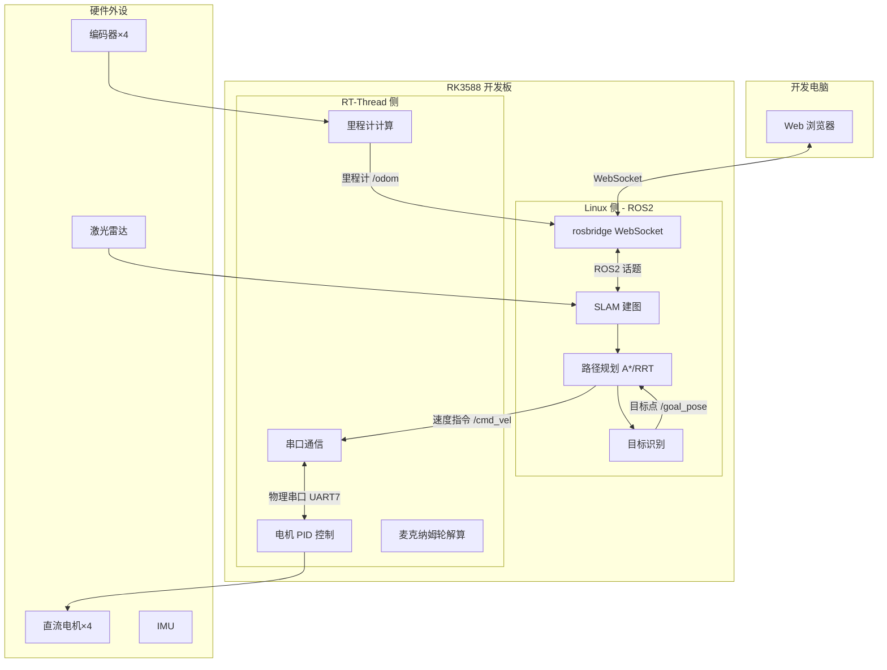

# 室内智能配送机器人 —— 基于 RT-Thread 与 RK3588

> 全国大学生嵌入式芯片与系统设计竞赛'2026 · 睿赛德赛题 · 选题一应用2

## 项目简介

本项目实现了一台室内智能配送机器人，能够自主导航、动态避障、精准停靠，完成指定地点的物品配送任务。机器人基于 **瑞芯微 RK3588** 平台，通过 **物理串口** 实现 Linux 侧（ROS2）与 RT-Thread 侧的数据通信。

- **Linux 侧**（大脑）：负责 SLAM 建图、路径规划、目标识别（二维码/房间标识）、动态障碍物检测
- **RT-Thread 侧**（小脑）：负责电机 PID 控制、麦克纳姆轮运动解算、多传感器融合定位、紧急停障

两部分通过 **UART7 物理串口**（波特率 1500000）通信，并配有 Web 可视化监控界面。

## 团队信息

| 角色 | 姓名 | 主要职责 |
|------|------|----------|
| 队长 / C 角色 | 赵文杰 | 系统集成、通信协议、可视化界面、整体联调 |
| A 角色 | 张明辉 | RT-Thread 实时控制、电机驱动、传感器读取 |
| B 角色 | 龙俊荣 | Linux 侧 SLAM、路径规划、目标检测 |

**学校**：中国计量大学  
**联系方式**：1446734408@qq.com

## 系统架构


```mermaid
flowchart TB
    subgraph PC[开发电脑]
        Web[Web 浏览器]
    end
    subgraph RK3588[RK3588 开发板]
        subgraph Linux[Linux 侧 - ROS2]
            L1[SLAM 建图]
            L2[路径规划 A*/RRT]
            L3[目标识别]
            L4[rosbridge WebSocket]
        end
        subgraph RTThread[RT-Thread 侧]
            R1[电机 PID 控制]
            R2[麦克纳姆轮解算]
            R3[里程计计算]
            R4[串口通信]
        end
    end
    subgraph Hardware[硬件外设]
        H1[直流电机×4]
        H2[编码器×4]
        H3[IMU]
        H4[激光雷达]
    end

    Web <-->|WebSocket| L4
    L4 <-->|ROS2 话题| L1
    L1 --> L2 --> L3
    L3 -->|目标点 /goal_pose| L2
    L2 -->|速度指令 /cmd_vel| R4
    R4 <-->|物理串口 UART7| R1
    R1 --> H1
    H2 --> R3
    R3 -->|里程计 /odom| L4
    H4 --> L1
```
## 硬件清单
|部件	|型号/规格|	数量	|备注|
|------|------|------|------|
|主控平台	|瑞芯微 RK3588 开发板（官方套件）|	1	|运行 Ubuntu 20.04 + RT-Thread|
|机器人底盘	|四轮麦克纳姆轮底盘（含直流减速电机）|	1	|全向移动，电机带霍尔编码器|
|电机驱动板	|TB6612FNG 四路驱动模块|	1	|带稳压板|
|激光雷达	|RPLIDAR A1	|1	|SLAM 建图|
|IMU|	MPU6050|	1	|姿态估计|
|电源	|12V 锂电池组	|1	|为底盘和开发板供电|
|USB串口模块|	CH340	|2	|调试 RT-Thread 和 Linux|

**详细引脚连接请参见**:docs/hardware_connection.md

## 软件依赖
Linux 侧（运行在 RK3588 Ubuntu 20.04 上）
ROS2 Foxy

micro-ROS Agent

rplidar_ros / slam_toolbox / nav2

rosbridge_server

Python 3.8+ / pyserial / flask / flask-socketio

RT-Thread 侧
RT-Thread 5.0.0+

驱动：PWM、UART、Encoder、GPIO

micro-ROS Client (集成于 chassis_car_app)

上位机（开发电脑）
Python 3.8+ / Flask / WebSocket

Chrome / Firefox 浏览器

## 快速开始
1. 克隆仓库
git clone https://github.com/Jasper87287/indoor-delivery-robot-rk3588.git
cd indoor-delivery-robot-rk3588
3. 小车端启动（每次上电）
Linux 侧：
```
ssh rock@<小车IP>
cd ~/Desktop/rock_ws/microros_ws
source install/setup.bash
ros2 run micro_ros_agent micro_ros_agent udp4 --port 8888
```
RT-Thread 侧（通过 USB 转 TTL 连接 UART7，波特率 1500000）：
```
microros_chassis udp 10.10.10.31 8888
chassis_car_app
```
3. 启动 Web 界面（电脑端）:
``` 
cd robot_web
python app.py
浏览器访问: http://localhost:5000
```
## 模块功能说明
|模块|路径|说明|
|------|------|------|
|RT-Thread 控制|	rtthread/	|电机控制、里程计计算、串口协议|
|Linux 规划感知	|linux/slam/, linux/planning/	|SLAM 建图、路径规划、目标检测|
|通信	|linux/comm/, rtthread/uart_comm.c|	物理串口自定义协议|
|可视化界面	|ui/	|Flask Web 界面，显示小车位置、控制按钮|
## 性能指标（实测）
|指标	|目标值	|实测值|
|------|------|------|
|导航定位精度|	±5 cm	|待测|
|动态避障响应时间|	≤0.5 s	|待测|
|停车稳定性（物品晃动）|	≤2 cm	|待测|

**作品展示**
-演示视频：链接待上传

-实物照片：docs/images/

**开源许可证**
本项目采用 GPLv3 许可证。

**致谢**
上海睿赛德电子科技有限公司提供的 RT-Thread 操作系统及竞赛支持

**联系方式**
如有问题，欢迎提 Issue 或联系：赵文杰 1446734408@qq.com


---

# 项目文档目录

本文件夹包含室内智能配送机器人的所有技术文档。

## 核心设计文档

| 文档 | 说明 | 负责人 |
|------|------|--------|
| [系统架构说明](system_architecture.md) | 整体架构图、模块划分、数据流 | 赵文杰 |
| [硬件连接表](hardware_connection.md) | 引脚定义、接线图、硬件清单 | 张明辉 |
| [通信协议文档](communication_protocol.md) | 串口帧格式、指令集、校验方式 | 赵文杰 |
| [RT-Thread 软件设计](rtthread_design.md) | 任务划分、PID控制、运动解算 | 张明辉 |
| [Linux 侧算法说明](linux_algorithm.md) | SLAM、路径规划、目标检测 | 龙俊荣 |

## 测试与报告

| 文档 | 说明 |
|------|------|
| [测试报告](test_report.md) | 性能测试数据、调试记录 |
| [用户手册](user_manual.md) | 编译、运行、操作指南 |

## 开发日志

| 文档 | 负责人 |
|------|--------|
| [赵文杰开发日志](development_log/log_zhaowenjie.md) | 赵文杰 |
| [张明辉开发日志](development_log/log_zhangminghui.md) |  张明辉|
| [龙俊荣开发日志](development_log/log_longjunrong.md) | 龙俊荣|

## 测试数据

| 文档 | 说明 |
|------|------|
| [测试数据索引](test_data/README.md) | 原始数据记录 |

## 图片资源

| 文件 | 说明 |
|------|------|
| [系统架构图](images/system_architecture.png) | Mermaid 导出的备份图 |
| [实物照片](images/robot_real.jpg) | 作品照片 |

---

**最后更新**：2026年5月  
**维护人**：赵文杰
