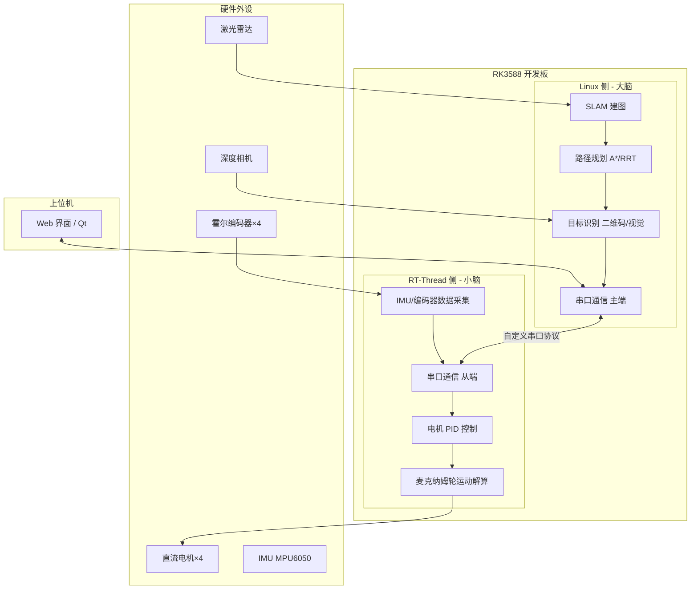

# 系统架构说明

## 1. 整体架构概述

本系统采用 **RT-Thread 虚拟化混合部署** 方案，在单颗瑞芯微 RK3588 芯片上同时运行 Linux 和 RT-Thread 两个操作系统：

- **Linux 侧**（大脑）：负责计算密集型的 AI 任务，包括 SLAM 建图、路径规划、目标检测等
- **RT-Thread 侧**（小脑）：负责高实时性控制任务，包括电机 PID 控制、麦克纳姆轮运动解算、传感器数据采集

两侧通过串口（UART）进行通信，实现决策与执行的协同工作。

## 2. 系统架构图

## 3. 模块功能说明
Linux 侧（龙俊荣负责）
|模块|	功能|	输入|	输出|
|------|------|------|------|
|SLAM 建图	|构建环境地图|	激光雷达数据	|占用栅格地图|
|路径规划	|规划起点到目标点的路径|	地图、当前位置、目标点|	路径点序列|
|目标识别	|识别二维码/房间标识	|摄像头图像	|目标点坐标|
|rosbridge	|WebSocket |桥接	|ROS2 话题|	HTTP/WS 数据|

RT-Thread 侧（张明辉负责）
|模块|	功能|	输入|	输出|
|------|------|------|------|
|串口通信|	接收速度指令，发送里程计|	自定义帧|	电机控制指令|
|电机 PID|	闭环控制电机转速	|目标速度、编码器反馈	PWM| 占空比|
|麦克纳姆轮解算	|将速度指令转为四轮转速|	vx, vy, omega	|4 路轮速|
|里程计计算	|根据编码器累加位姿|	编码器脉冲	|x, y, theta|

上位机（赵文杰负责）
|模块	|功能|	技术方案|
|------|------|-------|
|可视化界面|	显示小车位置、速度、地图|	Flask + WebSocket + roslibjs|
|控制面板	|发送目标点、急停	|HTTP + 自定义 API|

## 4. 数据流说明
- **控制流**：Web 界面设定目标点 → ROS2 /goal_pose → 路径规划 → 生成 /cmd_vel → 串口发送 → RT-Thread 解析 → 电机控制

- **状态流**：编码器数据 → RT-Thread 里程计计算 → 串口发送 → Linux /odom 话题 → rosbridge → Web 界面显示

## 5. 技术选型理由
|组件|	选型|	理由|
|------|------|------|
|主控芯片	|RK3588	|性能强，支持 ROS2 及 AI|
|RTOS	|RT-Thread	|竞赛指定，实时性好|
|通信	|物理串口 UART7|	稳定，绕开虚拟化问题|
|ROS2|	Foxy|	官方适配，生态丰富|
|可视化	|Flask + roslibjs	|跨平台，无需安装客户端|

## 6. 软硬件版本
|项目	|版本|
|------|------|
|RT-Thread	|5.0.0|
|Ubuntu	|20.04 LTS|
|ROS2|	Foxy|
|Python|3.8.10|

文档维护人：赵文杰
最后更新：2026年5月
